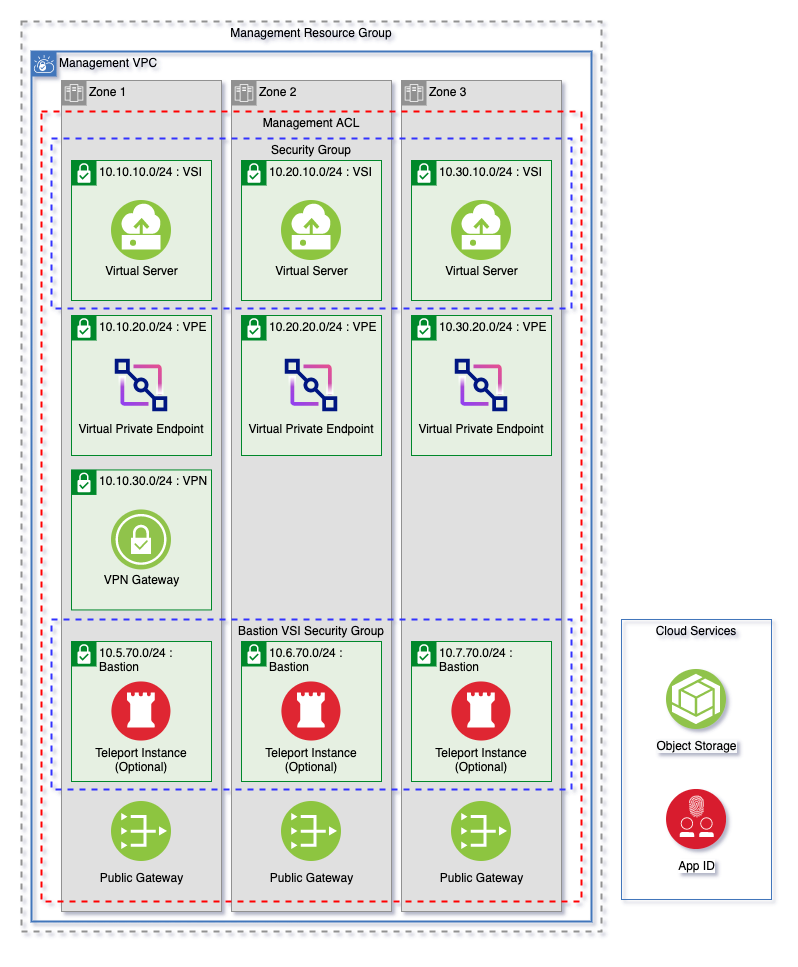
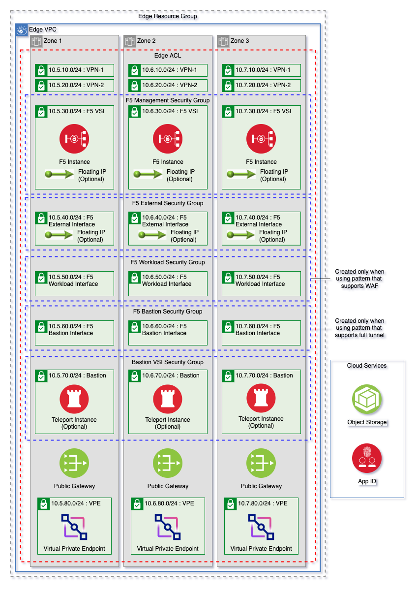

# Provisioning a bastion host using Teleport with Secure Landing Zone

Secure Landing Zone can provision the implemented solution described in the following [document](https://cloud.ibm.com/docs/allowlist/framework-financial-services?topic=framework-financial-services-vpc-architecture-connectivity-bastion-tutorial-teleport).

## Before you begin

You need the following items to deploy and configure a bastion host that uses Teleport:

- A Teleport Enterprise Edition license
- A generated SSL certificate and key for each of the provisioned virtual server instances or a wildcard certificate

## Provision with Secure Landing Zone

There are two locations that SLZ will provision the bastion host.  You can either place the bastion within the management VPC or in the edge VPC if you're using BIG-IP from F5.

| Management VPC                                     | Edge/Transit VPC              |
| ---------------------------------------------------| ----------------------------- |
|    | |

### Provisioning a bastion host in the management VPC

To provision Teleport within the management zone, you must set `teleport_management_zones` to the number of bastion hosts to deploy, up to a maximum of 3.  For example, if you set the number to `1`, it will provision a bastion host in zone-1 of your management VPC.  If you set the number to `2`, it will provision a bastion within zone-1 and zone-2 of your management VPC.  Other variables that are needed for the setup and configuration of Teleport are mentioned in the following sections.

### Provisioning a bastion host on the edge VPC with F5 BIG-IP

The `provision_teleport_in_f5` and `add_edge_vpc` variables must both be set to true. For more information about F5 deployment, see [Provisioning a F5 BIG-IP host using Secure Landing Zone](../f5-big-ip/f5-big-ip.md) and the following variables that are needed for the setup and configuration of Teleport.

Don't set both `create_f5_network_on_management_vpc` to true and `teleport_management_zones` to a value greater than `0`.

### Teleport configuration variables

The following variables need to be set to provision the bastion host using Teleport.

```
provision_teleport_in_f5  # Provision Teleport in the Edge VPC alongside the F5
use_existing_appid        # Use an existing appid instance. If this is false, one will be automatically
appid_name                # Name of appid instance.
appid_resource_group      # Resource group for existing appid instance. This value is ignored if a new instance is created.
teleport_instance_profile # Machine type for Teleport VSI instances. Use the IBM Cloud CLI command `ibmcloud is instance-profiles` to see available image profiles.
teleport_vsi_image_name   # Teleport VSI image name. Use the IBM Cloud CLI command `ibmcloud is images` to see availabled images.
teleport_license          # The contents of the PEM license file
https_cert                # The https certificate used by bastion host for teleport
https_key                 # The https private key used by bastion host for teleport
teleport_hostname         # The name of the instance or bastion host
teleport_domain           # The domain of the bastion host
teleport_version          # Version of Teleport Enterprise to use
message_of_the_day        # Banner message that is exposed to the user at authentication time
teleport_admin_email      # Email for teleport vsi admin.
teleport_management_zones # Number of zones to create teleport VSI on Management VPC if not using F5. If you are using F5, ignore this value
```

For more details about specifying input variables, see [Customizing Your Environment](../../README.md#using-terraform-input-variables)

For more information about the Teleport configuration variables, see the following documentation for the pattern:

- [VSI](../../patterns/vsi/README.md#module-variables)
- [Mixed](../../patterns/mixed/README.md#module-variables)
- [ROKS](../../patterns/roks/README.md#module-variables)


## Accessing Teleport

After App ID is successfully configured to Teleport, you can log in to Teleport through a web console or tsh client. tsh is the Teleport client tool that is the command line tool for Teleport. For more information, see [Installing tsh](https://goteleport.com/docs/server-access/guides/tsh/#installing-tsh). You need the fully qualified domain name (FQDN) of the Teleport server to log in.

### Log in through the web console

1. Access the web console on port 3080. (`https://<User defined FQDN of teleport server>:3080`)

2. Start a terminal session under Servers. There should be a single server with a connect button. Click connect and select the user that you would like to log in with.

### Log in through the tsh client

1. Install the [Teleport client tool tsh](https://goteleport.com/docs/server-access/guides/tsh/#installing-tsh)

2. [Log in using tsh](https://goteleport.com/docs/server-access/guides/tsh/#logging-in). ```tsh login --proxy=<User defined FQDN of teleport server>:3080```

3. Run shell or execute a command on a remote SSH node by using the [tsh ssh command](https://goteleport.com/docs/setup/reference/cli/#tsh-ssh) ```tsh ssh <[user@]host>```

## Debbuging Bastion Host VSI

After the bastion host is provisioned by the Secure Landing Zone, and you can't access Teleport that is installed on your virtual server, follow these steps to login and verify the configuration of your virtual server through SSH.  Please note that SSH by default is not allowed and you will need to add rules to the [security groups](https://cloud.ibm.com/vpc-ext/network/securityGroups) and [ACLs](https://cloud.ibm.com/vpc-ext/network/acl) on our virtual server.

1. Connect to your bastion host VSI by using [SSH](https://cloud.ibm.com/docs/vpc?topic=vpc-vsi_is_connecting_linux).

For steps 2-8, see if the values matches the ones you configured.

2. run ```cat ~/license.pem``` to verify if the content of the file equals your ```teleport_license```

3. run ```cat ~/cert.pem``` to verify if the content of the file equals your ```https_cert```

4. run ```cat ~/key.pem``` to verify if the content of the file equals your ```https_key```

5. run ```cat ~/oidc.yaml``` to verify if:
- the ```redirect_url``` value equals ```https://<HOSTNAME>.<DOMAIN>:3080/v1/webapi/oidc/callback```

- the ```claims_to_roles``` values equals  ```- {claim: "email", value: "<TELEPORT_ADMIN_EMAIL>", roles: ["teleport-admin"]}```

6. run ```cat ~/../etc/teleport.yaml``` to verify if the ```audit_sessions_uri``` value contains your ```cos_bucket_name```

7. run ```systemctl status teleport``` to verify teleport is running

8. Once you verified that teleport is configured correctly, remove the security group and ACL rules from step 1. You can also run the script `/root/install.sh` to execute the install again.

## ACL and Security Groups

By default, Secure Landing Zone provisions ACL's and Security Groups that are more open and non-customer dependent.  Please utilize [override.json](../../README.md#using-overridejson) file to manipulate add/delete rules appropriately for your environment.
