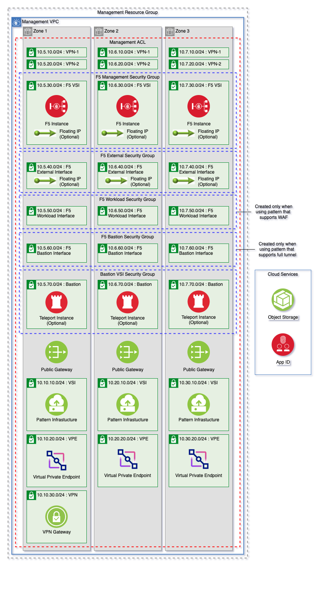

# Provisioning a F5 BIG-IP host by using Secure Landing Zone

Through Secure Landing Zone, you can optionally provision the F5 BIG-IP so that you can set up the implemented solution of a client-to-site VPN or web application firewall (WAF). For more information, see [Deploying and configuring F5 BIG-IP](https://cloud.ibm.com/docs/allowlist/framework-financial-services?topic=framework-financial-services-vpc-architecture-connectivity-f5-tutorial) (available by allowlist).

## Before you begin

You need the following items to deploy and configure the reference architecture that is described in Deploying and configuring F5 BIG-IP:

- F5 BIG-IP Virtual Edition license
- Additional IAM VPC Infrastructure Service service access of `IP Spoofing operator`
- [Contact support](https://cloud.ibm.com/unifiedsupport/cases/form) to increase the quota for subnets for each VPC. Thirty subnets per VPC cover most cases.

    The following chart shows the number of subnets that you need, depending on your F5 BIG-IP deployment.

    | Service     | # of subnets without bastion | # of subnets with bastion |
    | ----------- | ---------------------------- | ------------------------- |
    | VPN and WAF | 21                           | 24                        |
    | Full-tunnel | 18                           | 21
    | WAF         | 15                           | 18

    The following chart lists the CIDR blocks and the zones that each type is deployed. Additional subnets for VPEs are also provisioned along with bastion host, if that host is used.

    | CIDRs        | Zone        | WAF    | Full-tunnel    | VPN-and-WAF    |
    | ------------ | ----------- | :----: | :------------: | :------------: |
    | 10.5.10.0/24 | zone-1      | X      | X              | X              |
    | 10.5.20.0/24 | zone-1      | X      | X              | X              |
    | 10.5.30.0/24 | zone-1      | X      | X              | X              |
    | 10.5.40.0/24 | zone-1      |        | X              | X              |
    | 10.5.50.0/24 | zone-1      |        | X              | X              |
    | 10.5.60.0/24 | zone-1      |        |                | X              |
    | 10.6.10.0/24 | zone-2      | X      | X              | X              |
    | 10.6.20.0/24 | zone-2      | X      | X              | X              |
    | 10.6.30.0/24 | zone-2      | X      | X              | X              |
    | 10.6.40.0/24 | zone-2      |        | X              | X              |
    | 10.6.50.0/24 | zone-2      |        | X              | X              |
    | 10.6.60.0/24 | zone-2      |        |                | X              |
    | 10.7.10.0/24 | zone-3      | X      | X              | X              |
    | 10.7.20.0/24 | zone-3      | X      | X              | X              |
    | 10.7.30.0/24 | zone-3      | X      | X              | X              |
    | 10.7.40.0/24 | zone-3      |        | X              | X              |
    | 10.7.50.0/24 | zone-3      |        | X              | X              |
    | 10.7.60.0/24 | zone-3      |        |                | X              |

## Provision with Secure Landing Zone

The F5 BIG-IP can be provisioned in the management or edge/transit VPC. In this case, use the edge/transit VPC. By default, it provisions an F5 BIG-IP within each zone of the region. You can change this setting in the [override.json](../../README.md#using-overridejson) file.

| Management VPC                               | Edge/Transit VPC              |
| -------------------------------------------- | ----------------------------- |
|    | |

### F5 BIG-IP configuration variables

Some of the configuration variables are optional, but several are needed to provision the F5 BIG-IP. The following variables are important:

```
add_edge_vpc                        # Automatically adds the edge/transit VPC along with the F5 BIG-IP
create_f5_network_on_management_vpc # Provision the F5 BIG-IP in the management VPC
provision_teleport_on_f5            # Provision Teleport bastion hosts within the edge VPC. See bastion documentation for more information about bastion hosts
vpn_firewall_type                   # The type of service you are using the BIG-IP for (full-tunnel, waf, vpn-and-waf). This is required if you enable the F5 BIG-IP
hostname                            # Hostname of the F5 BIG-IP
domain                              # The domain name of the F5 BIG-IP
tmos_admin_password                 # The admin password to log into the management console (Requirements: Minimum length of 15 characters/Required Characters: Numeric = 1, Uppercase = 1, Lowercase = 1)
enable_f5_external_fip              # Enable a FIP on the external interface. Default is true
enable_f5_management_fip            # Enable a FIP on the management interface. Default is false
```

The following example shows how to provision an F5 with the following configuration:

- Create an edge/transit VPC
- Provision an F5 BIG-IP with the architecture setup for WAF in each zone
- Do not provision bastion host within the edge VPC
- Set the hostname to `example`
- Set the domain to `test.com`
- Set the console login to `Hello12345World`
- Enable a floating IP the external interface

   ```
   add_edge_vpc                        = true
   create_f5_network_on_management_vpc = false
   provision_teleport_on_f5            = false
   vpn_firewall_type                   = "waf"
   hostname                            = "example"
   domain                              = "test.com"
   tmos_admin_password                 = "Hello12345World" <!-- pragma: allowlist secret -->
   enable_f5_external_fip              = true
   enable_f5_management_fip            = false
   ```

For more details about specifying input variables, see [Customizing your environment](../../README.md#using-terraform-input-variables). For more information about the F5 configuration variables, see the following documentation for the pattern:

- [VSI](../../patterns/vsi#module-variables)
- [Mixed](../../patterns/mixed#module-variables)
- [ROKS](../../patterns/roks#module-variables)

### Accessing the F5 BIG-IP

You might not be able to access management console by floating IP address (if enabled) that is provisioned on your virtual server instance either on the management or external interface. Use the `tmos_admin_password` that you set earlier to access it.

### Setup of the client-to-site VPN and WAF

For more information about how to set up the client-to-site VPN and WAF, see [Deploying and configuring F5 BIG-IP](https://cloud.ibm.com/docs/allowlist/framework-financial-services?topic=framework-financial-services-vpc-architecture-connectivity-f5-tutorial) (available by allowlist).

### ACL and security groups

By default, Secure Landing Zone provisions ACLs and security groups that are more open and not customer dependent. Use the [override.json](../../README.md#using-overridejson) file to change, add, or delete rules for your environment.
