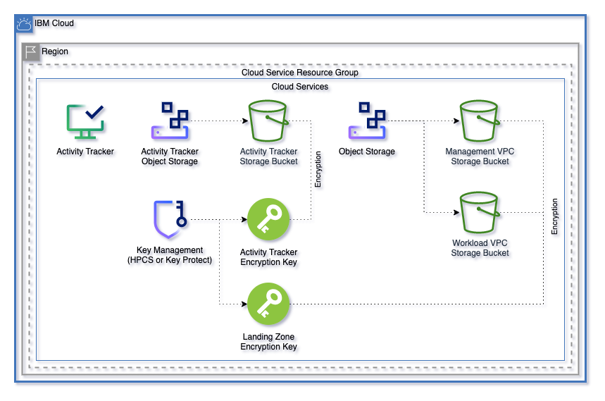
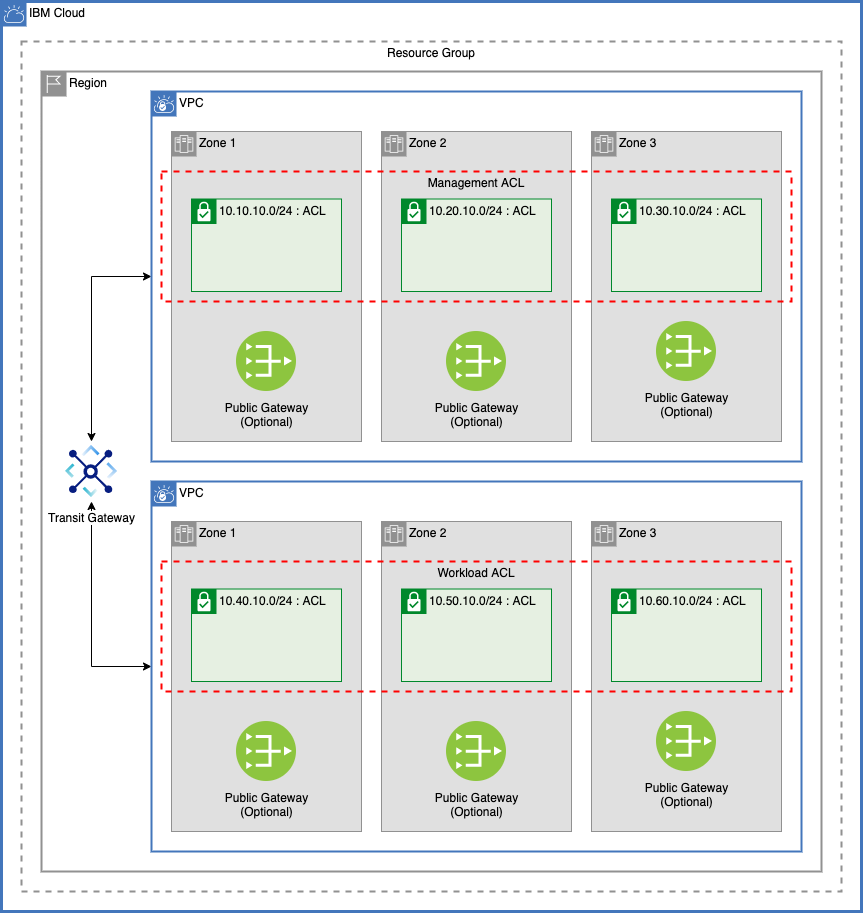
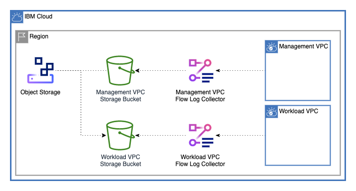
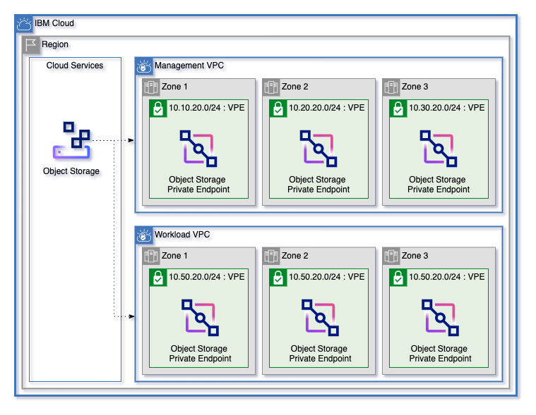

# Default Secure Landing Zone configuration

## Pattern variables

Each landing zone pattern takes just a few variables, so you can get started with IBM Cloud quickly and easily. Each pattern requires only the `ibmcloud_api_key`, `prefix`, and `region` variables to get started (the `ssh_public_key` must also be provided by users when they create patterns that use virtual servers).

---

### Variables available in all patterns

The following variables are available in all patterns.

| Name | Type | Description | Sensitive | Default |
|---|---|---|---|---|
| ibmcloud_api_key | string | The IBM Cloud platform API key needed to deploy IAM enabled resources. | true |  |
| TF_VERSION | string | The version of the Terraform engine used in the Schematics workspace. |  | 1.0 |
| prefix | string | A unique identifier for resources. Must begin with a lowercase letter and end with a lowercase letter or number. This prefix is added to any resources provisioned by this template. Prefixes must be 16 or fewer characters. |  |  |
| region | string | Region where VPC is created. To find your VPC region, use `ibmcloud is regions` command to find available regions. |  |  |
| tags | list(string) | List of tags to apply to resources created by this module. |  | [] |
| network_cidr | string | Network CIDR for the VPC that is used to manage network ACL rules for cluster provisioning. |  | 10.0.0.0/8 |
| vpcs | list(string) | List of VPCs to create. The first VPC in this list is always considered the `management` VPC and is where the VPN Gateway is connected. VPC names can have a maximum of 16 characters and can contain only lowercase letters, numbers, and `-` characters. VPC names must begin with a letter and end with a letter or number. |  | ["management", "workload"] |
| enable_transit_gateway | bool | Whether to create a transit gateway |  | true |
| add_atracker_route | bool | Whether to enable creating an Activity Tracker route. Activity Tracker can have only one route per zone. |  | true |
| hs_crypto_instance_name | string | Optionally, you can bring you own Hyper Protect Crypto Service instance for key management. If you would like to use that instance, add the name here. Otherwise, leave as null |  | null |
| hs_crypto_resource_group | string | If you're using Hyper Protect Crypto services in a resource group other than `Default`, provide the name here. |  | null |
| override | bool | Whether to override default values with custom JSON template. When set to `true`, use the `override.json` file to allow users to create a fully customized environment. |  | false |

### Variables for patterns that include virtual servers

The following variables apply to the [mixed pattern](../patterns/mixed/) and [VSI pattern](../patterns/vsi):

| Name | Type | Description | Sensitive | Default |
|---|---|---|---|---|
| ssh_public_key | string | Public SSH Key for VSI creation. Must be a valid SSH key that does not exist in the deployment region. |  |  |
| vsi_image_name | string | VSI image name. Use the IBM Cloud CLI command `ibmcloud is images` to see available images. |  | ibm-ubuntu-18-04-6-minimal-amd64-2 |
| vsi_instance_profile | string | VSI image profile. Use the IBM Cloud CLI command `ibmcloud is instance-profiles` to see available image profiles. |  | cx2-4x8 |
| vsi_per_subnet | number | Number of Virtual Servers to create on each VSI subnet. |  | 1 |

### Variables for Patterns that include Red Hat OpenShift clusters

The following variables apply to the [mixed pattern](../patterns/mixed/) and the [ROKS pattern](../patterns/roks/):

| Name | Type | Description | Sensitive | Default |
|---|---|---|---|---|
| cluster_zones | number | Number of zones to provision clusters for each VPC. At least one zone is required. Can be 1, 2, or 3 zones. |  | 3 |
| kube_version | string | Kubernetes version to use for cluster. To get available versions, use the IBM Cloud CLI command `ibmcloud ks versions`. To use the default version, leave as `default`. Updates to the default versions might force this to change. |  | default |
| flavor | string | Machine type for cluster. Use the IBM Cloud CLI command `ibmcloud ks flavors` to find valid machine types |  | bx2.16x64 |
| workers_per_zone | number | Number of workers in each zone of the cluster. Red Hat OpenShift requires at least two workers. |  | 1 |
| wait_till | string | To avoid long waiting times when you run your Terraform code, you can specify the stage when you want Terraform to mark the cluster resource creation as completed. Depending on what stage you choose, the cluster creation might not be fully completed and continues to run in the background. However, your Terraform code can continue to run without waiting for the cluster to be fully created. Supported args are `MasterNodeReady`, `OneWorkerNodeReady`, and `IngressReady` |  | IngressReady |
| update_all_workers | bool | Whether to update all workers to a new Kubernetes version |  | false |
| entitlement | string | Leave as null if you don't have an entitlement. Entitlement reduces additional OpenShift Container Platform license cost in Red Hat OpenShift clusters. Use Cloud Pak with OpenShift Container Platform license entitlement to create the Red Hat OpenShift cluster. Set this argument to `cloud_pak` only if you use the cluster with a Cloud Pak that has an Red Hat OpenShift entitlement. <br/><br/>This variable is set only when you create the cluster. Further modifications are not affected by this setting. |  | null |

## Resource groups

For each of the following resource groups, the `prefix` variable and a hyphen are added to the name (for example, `slz-management-rg` if `prefix` is `slz`).

Name            | Description
----------------|------------------------------------------------
`management-rg` | Management virtual infrastructure components
`workload-rg`   | Workload virtual infrastructure components
`service-rg`    | Cloud service instances

## Cloud services



### Key management

A Key Protect instance is created unless the `hs_crypto_instance_name` variable is provided. By default, Key Protect instances are provisioned in the `service-rg` resource group.

#### Keys

Name            | Description
----------------|------------------------------------------------
`atracker-key`  | Encryption key for the Activity Tracker instance
`slz-key`       | Encryption key for landing zone services

### Cloud Object Storage

Two Cloud Object Storage instances are created in the `service-rg` by default.

Name            | Description
----------------|------------------------------------------------
`atracker-cos`  | Object storage for Activity Tracker
`cos`           | Object storage

#### Storage buckets

Name                | Instance       | Encryption key | Description
--------------------|----------------|----------------|---------------------------------------------
`atracker-bucket`   | `atracker-cos` | `atracker-key` | Bucket for activity tracker logs
`management-bucket` | `cos`          | `slz-key`      | Bucket for flow logs from Management VPC
`workload-bucket`   | `cos`          | `slz-key`      | Bucket for flow logs from Workload VPC

#### Storage API keys

An API key is generated for the `atracker-cos` instance to allow Activity Tracker to connect to Cloud Object Storage.

### Activity Tracker

An [Activity Tracker](url-here) instance is provisioned for this architecture.

## VPC infrastructure



By default, two VPCs are created `management` and `workload`. All the components for the management VPC are provisioned in the `management-rg` resource group and the workload VPC components are all provisioned in the `workload-rg` resource group.

### Network access control lists

An [access control list](https://cloud.ibm.com/docs/vpc?topic=vpc-using-acls) is created for each VPC to allow inbound communication within the network, inbound communication from IBM services, and to allow all outbound traffic.

Rule                        | Action | Direction | Source        | Destination
----------------------------|--------|-----------|---------------|----------------
`allow-ibm-inbound`         | Allow  | Inbound   | 161.26.0.0/16 | 10.0.0.0/8
`allow-all-network-inbound` | Allow  | Inbound   | 10.0.0.0/8    | 10.0.0.0/8
`allow-all-outbound`        | Allow  | Outbound  | 0.0.0.0/0     | 0.0.0.0/0

#### Cluster rules

By default, to make sure that clusters can be created on VPCs, the following rules are added to ACLs where clusters are provisioned. For more information about controlling Red Hat OpenShift cluster traffic with ACLs, see the documentation [here](https://cloud.ibm.com/docs/openshift?topic=openshift-vpc-acls).

Rule                                               | Action | TCP / UDP | Direction | Source        | Source Port   | Destination   | Destination Port
---------------------------------------------------|--------|-----------|-----------|---------------|---------------|---------------|-------------------
Create worker nodes                                | Allow  | Any       | inbound   | 161.26.0.0/16 | Any           | 10.0.0.0/8    | Any
Communicate with service instances                 | Allow  | Any       | inbound   | 166.8.0.0/14  | Any           | 10.0.0.0/8    | Any
Allow incoming application traffic                 | Allow  | TCP       | inbound   | 10.0.0.0/8    | 30000 - 32767 | 10.0.0.0/8    | Any
Expose applications using load balancer or ingress | Allow  | TCP       | inbound   | 10.0.0.0/8    | Any           | 10.0.0.0/8    | 443
Create worker nodes                                | Allow  | Any       | outbound  | 10.0.0.0/8    | Any           | 161.26.0.0/16 | Any
Communicate with service instances                 | Allow  | Any       | outbound  | 10.0.0.0/8    | Any           | 166.8.0.0/14  | Any
Allow incoming application traffic                 | Allow  | TCP       | outbound  | 10.0.0.0/8    | Any           | 10.0.0.0/8    | 30000 - 32767
Expose applications using load balancer or ingress | Allow  | TCP       | outbound  | 10.0.0.0/8    | 443           | 10.0.0.0/8    | Any

### Subnets

Each VPC creates two tiers of subnets, each attached to the network ACL created for that VPC. The management VPC also creates a subnet for the VPN Gateway.

#### Management VPC subnets

Subnet Tier | Zone 1 Subnet Name | Zone 1 CIDR   | Zone 2 Subnet Name | Zone 2 CIDR   | Zone 3 Subnet Name | Zone 3 CIDR   |
------------|--------------------|---------------|--------------------|---------------|--------------------|---------------|
`vsi`       | `vsi-zone-1`       | 10.10.10.0/24 | `vsi-zone-2`       | 10.10.20.0/24 | `vsi-zone-3`       | 10.10.30.0/24 |
`vpe`       | `vpe-zone-1`       | 10.20.10.0/24 | `vpe-zone-2`       | 10.20.20.0/24 | `vsi-zone-3`       | 10.20.30.0/24 |
`vpn`       | `vpn-zone-1`       | 10.30.10.0/24 |

#### Workload VPC subnets

Subnet Tier | Zone 1 Subnet Name | Zone 1 CIDR   | Zone 2 Subnet Name | Zone 2 CIDR   | Zone 3 Subnet Name | Zone 3 CIDR   |
------------|--------------------|---------------|--------------------|---------------|--------------------|---------------|
`vsi`       | `vsi-zone-1`       | 10.40.10.0/24 | `vsi-zone-2`       | 10.40.20.0/24 | `vsi-zone-3`       | 10.40.30.0/24 |
`vpe`       | `vpe-zone-1`       | 10.50.10.0/24 | `vpe-zone-2`       | 10.50.20.0/24 | `vsi-zone-3`       | 10.50.30.0/24 |

### Flow logs

Using the Cloud Object Storage bucket provisioned for each VPC network, a flow log collector is created.



### Virtual Private Endpoints

Each VPC dynamically has a Virtual Private Endpoint address for the `cos` instance that is created in each zone of that VPC's `vpe` subnet tier.



### Default VPC security group

The default VPC security group allows all outbound traffic and inbound traffic from within the security group.

## Virtual server deployments

For the `vsi` pattern, identical virtual server deployments are created on each zone of the `vsi` tier of each VPC. For the `mixed` pattern, virtual servers are created only on the Management VPC. The number of these Virtual servers can be changed using the `vsi_per_subnet` variable.

### Boot volume encryption

Boot volumes for each virtual server are encrypted by the `slz-key`

### Virtual server image

To find available virtual servers in your region, use the following IBM Cloud CLI command:

```sh
ibmcloud is images
```

### Virtual Server Profile

To find available hardware configurations in your region, use the following IBM Cloud CLI command:

```sh
ibmcloud is instance-profiles
```

### Additional components

Virtual Server components like additional block storage and Load Balancers can be configured using `override.json` and those variable definitions can be found in the [landing-zone module](../landing-zone/variables.tf#L457)

## Red Hat OpenShift cluster deployments

For the ROKS pattern, identical Red Hat OpenShift cluster deployments are created on each zone of the `vsi` tier of each VPC. For the `mixed` pattern, clusters are created only on the workload VPC. Clusters can be deployed across 1, 2, or 3 zones by using the `cluster_zones` variable.

Clusters deployed use the most recent default cluster version.

### Workers per zone

The number of workers in each zone of the cluster can be changed by using the `workers_per_subnet` variable. At least two workers must be available for clusters to successfully provision.

### Cluster flavor

To find available hardware configurations in your region, use the following IBM Cloud CLI command:

```sh
ibmcloud ks flavors
```
