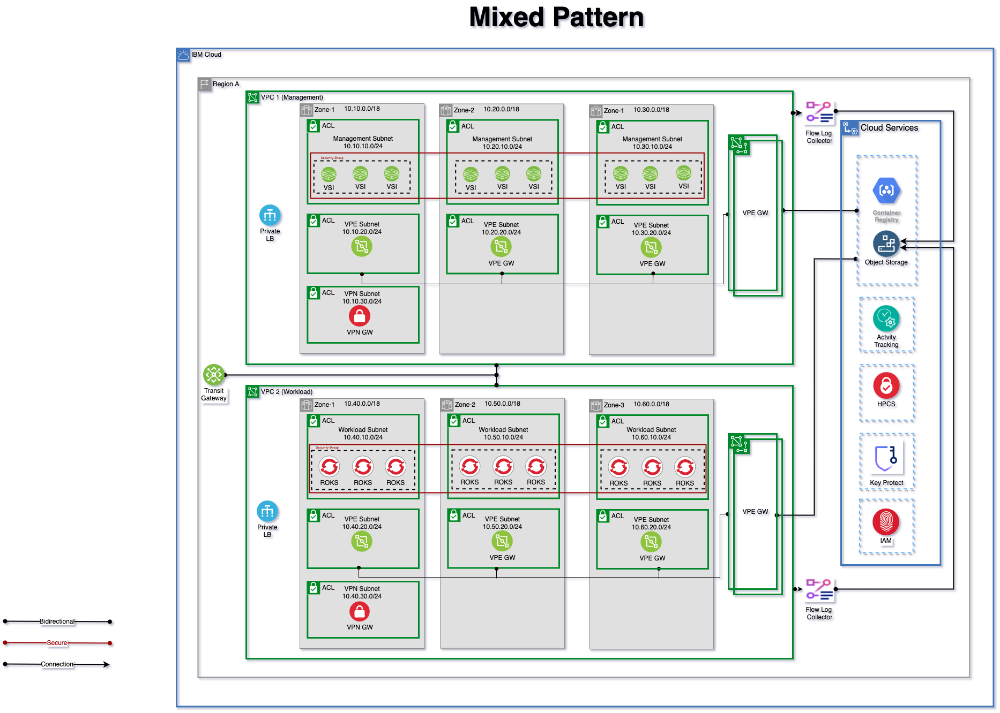

# IBM Secure Landing Zone for the mixed pattern

## Architecture diagram

## Configured components and services

The following common services are created:

- Resource groups
- Access groups
- Transit gateway

The following components are configured through automation.

| Multi-Zone Region (MZR) management | Multi-Zone Region (MZR) workload |
|---|---|
| Management access group | Workload access group |
| Management KMS key | Workload KMS key |
| Management Cloud Object Storage Instance and Cloud Object Storage buckets | Workload Cloud Object Storage instance and Cloud Object Storage buckets |
| Management Cloud Object Storage Authorization for Hyper Protect Crypto Services and KeyProtect | Workload Cloud Object Storage Authorization for Hyper Protect Crypto Services and KeyProtect |
| Management Flow Log, Flow log Cloud Object Storage buckets and authorization | Workload flow log, Flow log Cloud Object Storage buckets and authorization |
| Management VPC | Workload VPC |
| Management VPC VSI | Workload Red Hat OpenShift cluster |
| Management VPC VSI encryption authorization | Workload Kubernetes encryption authorization |
| Management VPC VSI SSH module | Workload subnets for OpenShift Container Platform cluster, VPE, and VPN resources |
| Management subnets for VSI, VPE, and VPN resources | Workload VPE gateway (for Cloud Object Storage) |
| Management VPE gateway (for Cloud Object Storage) | Workload VPE gateway (for Container Registry) |
| Management VPE gateway (for Container Registry) |  |
