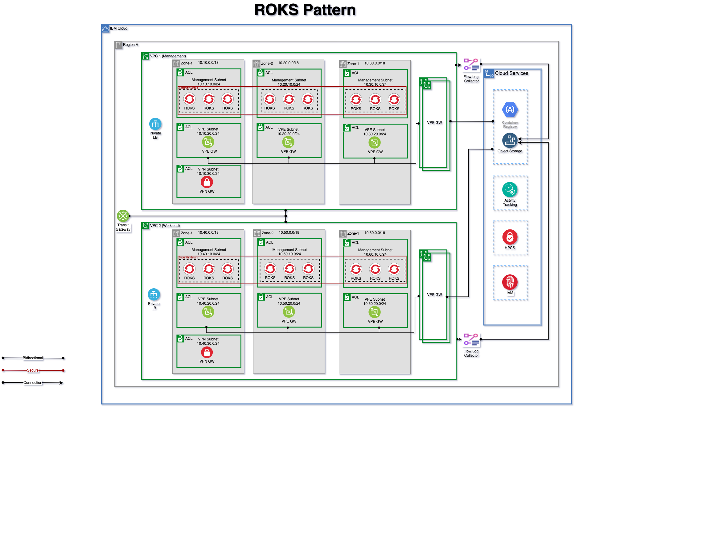

# IBM Secure Landing Zone for IBM Cloud Red Hat OpenShift Kubernetes Pattern

## Architecture diagram

## Configured Components and Services

The following components are configured through automation:

## Configured Components and Services
----------------------------------------------------------------
* Resource groups
* KMS Service

* Management Access Group
* Management KMS Key
* Management COS Instance and COS buckets
* Management COS Authorization for KMS
* Management Flow Log, Flow log COS buckets and authorization
* Management VPC
* Management OCP Cluster
* Management VPC Kubernetes encryption authorization
* Management Subnets for OCP Cluster, VPE and VPN resources
* Management VPE Gateway (for COS)
* Management VPE Gateway (for Container Registry)

* Workload Access Group
* Workload KMS Key
* Workload COS Instance and COS buckets
* Workload COS Authorization for KMS
* Workoad Flow Log, Flow log COS buckets and authorization
* Workload VPC
* Workload OCP Cluster
* Workload VPC Kubernetes encryption authorization
* Workload Subnets for VPC OCP Cluster, VPE and VPN resources
* Workload VPE Gateway (for COS)
* Workload VPE Gateway (for Container Registry)

* IBM Transit Gateway
