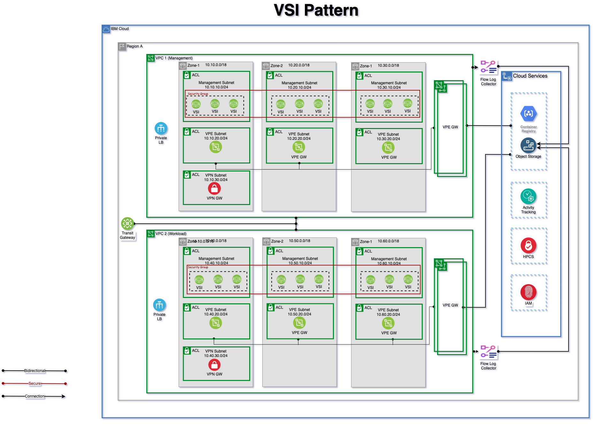

# IBM Secure Landing Zone for VSI Pattern

## Artchitecture Diagram

## Configured Components and Services

The following components are configured through automation

----------------------------------------------------------------
* Resource groups
* KMS Service

* Management Access Group
* Management KMS Key
* Management COS Instance and COS buckets
* Management COS Authorization for HPCS
* Management Flow Log, Flow log COS buckets and authorization
* Management VPC
* Management VPC VSI
* Management VPC VSI encryption authorization
* Management VPC VSI SSH module
* Management Subnets for VSI, VPE and VPN resources
* Management VPE Gateway (for COS)

* Workload Access Group
* Workload KMS Key
* Workload COS Instance and COS buckets
* Workload COS Authorization for HPCS
* Workoad Flow Log, Flow log COS buckets and authorization
* Workload VPC
* Workload VPC VSI
* Workload VPC VSI encryption authorization
* Workload VPC VSI SSH module
* Workload Subnets for VPC VSI, VPE and VPN resources
* Workload VPE Gateway (for COS)

* IBM Transit Gateway
