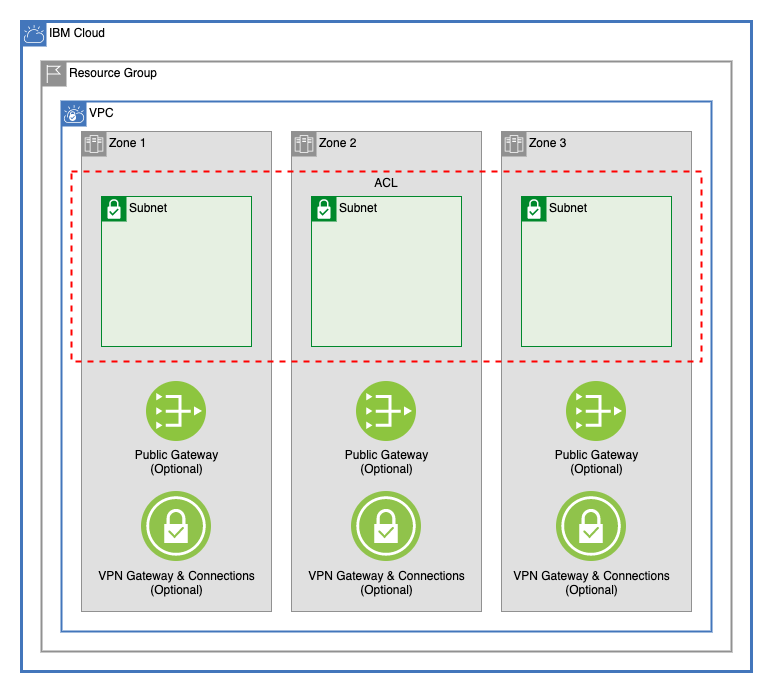

# IBM VPC Terraform module

This module creates underlying VPC network components:

- VPC
- Public Gateways
- Subnets
- Network ACLs
- VPN Gateways
- VPN Gateway Connections



## Table of Contents

1. [VPC](#vpc)
2. [Public Gateways](#public-gateways)
3. [Network ACLs](#network-acls)
4. [Subnets](#subnets)
   1. [Address Prefixes](#address-prefixes)
   2. [Subnets](#subnets-1)
5. [VPN Gateways](#vpn-gateways)
6. [Module Variables](#module-variables)
7. [Module Outputs](#module-outputs)
8. [As A Module in a Larger Architecture](#as-a-module-in-a-larger-architecture)
9. [Usage](#usage)

## VPC

This module creates a VPC in a resource group with optional Classic Access. The VPC and components are created in [main.tf](main.tf)

---

## Public Gateways

This module allows a user to optionally create public gateways in the VPC in each of the three zones of the VPC's region.

---

## Network ACLs

This module creates any number of network ACLs with any number of rules. *(Note: by default, VPC Network ACLs have a maximum of 25 rules.)*

---

## Subnets

The [subnet.tf](./subnet.tf) file allows users to create subnets in 1, 2, or 3 zones. Public gateways can be optionally attached to each subnet. Each subnet can also be given as a parameter any ACL created within this module.

### Address Prefixes

A CIDR block is created in the VPC for each subnet that will be provisioned

### Subnets

The type of the `subnets` variable is as follows:

```terraform
object({
    zone-1 = list(object({
      name           = string
      cidr           = string
      acl_name       = string
      public_gateway = optional(bool)
    }))
    zone-2 = list(object({
      name           = string
      cidr           = string
      acl_name       = string
      public_gateway = optional(bool)
    }))
    zone-3 = list(object({
      name           = string
      cidr           = string
      acl_name       = string
      public_gateway = optional(bool)
    }))
  })
```

While `zone-1`, `zone-2`, and `zone-3` are all lists, these lists are converted into an object before the resources are provisioned. This ensures that the addition or deletion of subnets will affect only the added or deleted subnets. Example:

```terraform
module.subnets.ibm_is_subnet.subnet["gcat-multizone-subnet-a"]
module.subnets.ibm_is_subnet.subnet["gcat-multizone-subnet-b"]
module.subnets.ibm_is_subnet.subnet["gcat-multizone-subnet-c"]
module.subnets.ibm_is_vpc_address_prefix.subnet_prefix["gcat-multizone-subnet-a"]
module.subnets.ibm_is_vpc_address_prefix.subnet_prefix["gcat-multizone-subnet-b"]
module.subnets.ibm_is_vpc_address_prefix.subnet_prefix["gcat-multizone-subnet-c"]
```

---

## VPN Gateways

This module can create any number of VPN gateways on any number of subnets using the `vpn_gateways` variable. For more about VPN gateways on VPC [read the documentation here](https://cloud.ibm.com/docs/vpc?topic=vpc-using-vpn)

---

## Module Variables

Name                        | Type                                                                                                                                                                                                                                                                                                                                                                                                                                                                                                                                                                                                                                       | Description                                                                                                                                                                                                                                                                                                                                                                          | Sensitive | Default
--------------------------- | ------------------------------------------------------------------------------------------------------------------------------------------------------------------------------------------------------------------------------------------------------------------------------------------------------------------------------------------------------------------------------------------------------------------------------------------------------------------------------------------------------------------------------------------------------------------------------------------------------------------------------------------ | ------------------------------------------------------------------------------------------------------------------------------------------------------------------------------------------------------------------------------------------------------------------------------------------------------------------------------------------------------------------------------------ | --------- | --------------------------------------------------------------------------------------------------------------------------------------------------------------------------------------------------------------------------------------------------------------------------------------------------------------------
resource_group_id           | string                                                                                                                                                                                                                                                                                                                                                                                                                                                                                                                                                                                                                                     | The resource group ID where the VPC to be created                                                                                                                                                                                                                                                                                                                                    |           | 
region                      | string                                                                                                                                                                                                                                                                                                                                                                                                                                                                                                                                                                                                                                     | The region to which to deploy the VPC                                                                                                                                                                                                                                                                                                                                                |           | 
prefix                      | string                                                                                                                                                                                                                                                                                                                                                                                                                                                                                                                                                                                                                                     | The prefix that you would like to append to your resources                                                                                                                                                                                                                                                                                                                           |           | 
tags                        | list(string)                                                                                                                                                                                                                                                                                                                                                                                                                                                                                                                                                                                                                               | List of Tags for the resource created                                                                                                                                                                                                                                                                                                                                                |           | null
vpc_name                    | string                                                                                                                                                                                                                                                                                                                                                                                                                                                                                                                                                                                                                                     | The resource group ID where the VPC to be created. If left null, one will be generated using the prefix for this module.                                                                                                                                                                                                                                                             |           | null
classic_access              | bool                                                                                                                                                                                                                                                                                                                                                                                                                                                                                                                                                                                                                                       | OPTIONAL - Classic Access to the VPC                                                                                                                                                                                                                                                                                                                                                 |           | false
use_manual_address_prefixes | string                                                                                                                                                                                                                                                                                                                                                                                                                                                                                                                                                                                                                                     | OPTIONAL - Use manual address prefixes for VPC                                                                                                                                                                                                                                                                                                                                       |           | false
default_network_acl_name    | string                                                                                                                                                                                                                                                                                                                                                                                                                                                                                                                                                                                                                                     | OPTIONAL - Name of the Default ACL. If null, a name will be automatically genetated                                                                                                                                                                                                                                                                                                  |           | null
default_security_group_name | string                                                                                                                                                                                                                                                                                                                                                                                                                                                                                                                                                                                                                                     | OPTIONAL - Name of the Default Security Group. If null, a name will be automatically genetated                                                                                                                                                                                                                                                                                       |           | null
default_routing_table_name  | string                                                                                                                                                                                                                                                                                                                                                                                                                                                                                                                                                                                                                                     | OPTIONAL - Name of the Default Routing Table. If null, a name will be automatically genetated                                                                                                                                                                                                                                                                                        |           | null
address_prefixes            | object({ zone-1 = optional(list(string)) zone-2 = optional(list(string)) zone-3 = optional(list(string)) })                                                                                                                                                                                                                                                                                                                                                                                                                                                                                                                                | OPTIONAL - IP range that will be defined for the VPC for a certain location. Use only with manual address prefixes                                                                                                                                                                                                                                                                   |           | { zone-1 = null zone-2 = null zone-3 = null }
network_acls                | list( object({ name = string network_connections = optional(list(string)) add_cluster_rules = optional(bool) rules = list( object({ name = string action = string destination = string direction = string source = string tcp = optional( object({ port_max = optional(number) port_min = optional(number) source_port_max = optional(number) source_port_min = optional(number) }) ) udp = optional( object({ port_max = optional(number) port_min = optional(number) source_port_max = optional(number) source_port_min = optional(number) }) ) icmp = optional( object({ type = optional(number) code = optional(number) }) ) }) ) }) ) | List of ACLs to create. Rules can be automatically created to allow inbound and outbound traffic from a VPC tier by adding the name of that tier to the `network_connections` list. Rules automatically generated by these network connections will be added at the beginning of a list, and will be web-tierlied to traffic first. At least one rule must be provided for each ACL. |           | [ { name = "vpc-acl" add_cluster_rules = true rules = [ { name = "allow-all-inbound" action = "allow" direction = "inbound" destination = "0.0.0.0/0" source = "0.0.0.0/0" }, { name = "allow-all-outbound" action = "allow" direction = "outbound" destination = "0.0.0.0/0" source = "0.0.0.0/0" } ] } ]
use_public_gateways         | object({ zone-1 = optional(bool) zone-2 = optional(bool) zone-3 = optional(bool) })                                                                                                                                                                                                                                                                                                                                                                                                                                                                                                                                                        | Create a public gateway in any of the three zones with `true`.                                                                                                                                                                                                                                                                                                                       |           | { zone-1 = true zone-2 = false zone-3 = false }
subnets                     | object({ zone-1 = list(object({ name = string cidr = string public_gateway = optional(bool) acl_name = string })) zone-2 = list(object({ name = string cidr = string public_gateway = optional(bool) acl_name = string })) zone-3 = list(object({ name = string cidr = string public_gateway = optional(bool) acl_name = string })) })                                                                                                                                                                                                                                                                                                     | List of subnets for the vpc. For each item in each array, a subnet will be created. Items can be either CIDR blocks or total ipv4 addressess. Public gateways will be enabled only in zones where a gateway has been created                                                                                                                                                         |           | { zone-1 = [ { name = "subnet-a" cidr = "10.10.10.0/24" public_gateway = true acl_name = "vpc-acl" } ], zone-2 = [ { name = "subnet-b" cidr = "10.20.10.0/24" public_gateway = true acl_name = "vpc-acl" } ], zone-3 = [ { name = "subnet-c" cidr = "10.30.10.0/24" public_gateway = true acl_name = "vpc-acl" } ] }
routes                      | list( object({ name = string zone = number destination = string next_hop = string }) )                                                                                                                                                                                                                                                                                                                                                                                                                                                                                                                                                     | OPTIONAL - Allows you to specify the next hop for packets based on their destination address                                                                                                                                                                                                                                                                                         |           | []
vpn_gateways                | list( object({ name = string subnet_name = string mode = optional(string) tags = optional(list(string)) connections = list( object({ peer_address = list(string) preshared_key = string local_cidrs = optional(list(string)) peer_cidrs = optional(list(string)) admin_state_up = optional(bool) }) ) }) )                                                                                                                                                                                                                                                                                                                                 | List defining the information needed to create a VPN service to securely connect your VPC to another private network                                                                                                                                                                                                                                                                 |           | []

---

## Module Outputs

Name                   | Description
---------------------- | -----------------------------------------------------------
vpc_id                 | ID of VPC created
vpn_gateway_public_ips | List of VPN Gateway public IPS
subnet_ids             | The IDs of the subnets
subnet_detail_list     | A list of subnets containing names, CIDR blocks, and zones.
subnet_zone_list       | A list containing subnet IDs and subnet zones

---

## As A Module in a Larger Architecture

## Usage
```terraform
module vpc {
  source                      = "./vpc"
  resource_group_id           = var.resource_group_id
  region                      = var.region
  prefix                      = var.prefix
  tags                        = var.tags
  vpc_name                    = var.vpc_name
  classic_access              = var.classic_access
  network_acls                = var.network_acls
  use_public_gateways         = var.use_public_gateways
  subnets                     = var.subnets
  vpn_gateways                = var.vpn_gateways
}
```
