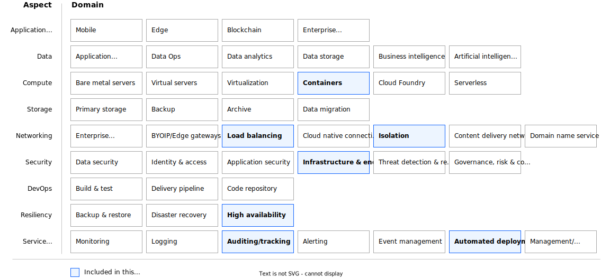

---

copyright:
  years: 2023
lastupdated: "2023-06-23"

keywords:

subcollection: deployable-reference-architectures

authors:
  - name: "Vincent Burckhardt"

# The release that the reference architecture describes
version: 4.1.2

# Whether the reference architecture is published to Cloud Docs production.
# When set to false, the file is available only in staging. Default is false.
production: true

# Use if the reference architecture has deployable code.
# Value is the URL to land the user in the IBM Cloud catalog details page
# for the deployable architecture.
# See https://test.cloud.ibm.com/docs/get-coding?topic=get-coding-deploy-button
deployment-url: https://cloud.ibm.com/catalog/architecture/deploy-arch-ibm-slz-ocp-95fccffc-ae3b-42df-b6d9-80be5914d852-global

docs: https://cloud.ibm.com/docs/secure-infrastructure-ocp

image_source: https://github.com/terraform-ibm-modules/terraform-ibm-landing-zone/blob/main/reference-architectures/roks.drawio.svg

related_links:
  - title: "VSI on VPC landing zone - Standard variation"
    url: "https://cloud.ibm.com/docs/deployable-reference-architectures?topic=deployable-reference-architectures-vsi-ra"
    description: "A deployable architecture that is based on the IBM Cloud for Financial Services reference and that provides virtual servers in a secure VPC for your workloads."

use-case: Cybersecurity
industry: Banking,FinancialSector
compliance: FedRAMP

content-type: reference-architecture

---

{{site.data.keyword.attribute-definition-list}}

# Red Hat OpenShift Container Platform on VPC landing zone
{: #ocp-ra}
{: toc-content-type="reference-architecture"}
{: toc-industry="Banking,FinancialSector"}
{: toc-use-case="Cybersecurity"}
{: toc-compliance="FedRAMP"}
{: toc-version="4.1.2"}

Red Hat OpenShift Container Platform on VPC landing zone is a deployable architecture solution that is based on the IBM Cloud for Financial Services reference architecture. It creates secure and compliant Red Hat OpenShift Container Platform workload clusters on a Virtual Private Cloud (VPC) network.

## Architecture diagram
{: #ra-ocp-architecture-diagram}

{: caption="Figure 1. Single region architecture diagram for Red Hat OpenShift Container Platform on VPC on IBM Cloud" caption-side="bottom"}{: external download="roks.drawio.svg"}

## Design requirements
{: #ra-ocp-design-requirements}

{: caption="Figure 2. Scope of the design requirements" caption-side="bottom"}

<!--
TODO: Add the typical use case for the architecture.
The use case might include the motivation for the architecture composition,
business challenge, or target cloud environments.
-->

## Components
{: #ra-ocp-components}

### VPC architecture decisions
{: #ra-ocp-components-arch}

| Requirement | Component | Reasons for choice | Alternative choice |
|-------------|-----------|--------------------|--------------------|
| Provide access management and tooling for the workload that is deployed in the workload VPC | Management VPC service | Create a separate VPC service where SSH connectivity from outside is allowed | |
| Provide compute, storage, and network services to support hosted applications and operations that deliver services to the consumer | Workload VPC service | Create a separate VPC service as an isolated environment, without direct public internet connectivity and without direct SSH access | |
| * Demonstrate compliance with control requirements of the IBM Cloud Framework for Financial Services  \n * Set up network for all created services  \n * Isolate network for all created services  \n * Ensure all created services are interconnected | Secure landing zone components | Create a minimum set of required components for a secure landing zone | Create a modified set of required components for a secure landing zone in preset |
{: caption="Table 1. Architecture decisions" caption-side="bottom"}

### Network security architecture decisions
{: #ra-ocp-components-arch-net-sec}

| Requirement | Component | Reasons for choice | Alternative choice |
|-------------|-----------|--------------------|--------------------|
| * Isolate management VPC and allow only a limited number of network connections  \n * All other connections from or to management VPC are forbidden | ACL and security group rules in management VPC | | More ports might be opened in preset or added manually after deployment |
| * Isolate workload VPC and allow only a limited number of network connections  \n * All other connections from or to workload VPC are forbidden | ACL and security group rules in workload VPC | Open following ports by default: 53 (DNS service)  \n All ports to other VPCs are open | More ports might be opened in preset or added manually after deployment |
| Enable floating IP on bastion host to execute deployment | Floating IPs on bastion host in management VPC|Use floating IP on bastion host from IBM Schematics to complete deployment | |
| Load VPN configuration to simplify VPN setup | VPNs | VPN configuration is the responsibility of the customer | |
| Collect and store Internet Protocol (IP) traffic information with Activity Tracker and Flow Logs | Activity Tracker | | |
| Securely connect to multiple networks with a site-to-site virtual private network | | | |
{: caption="Table 2. Network security architecture decisions" caption-side="bottom"}

<!--
## Compliance
{: #ra-ocp-compliance}

TODO: Decide whether to include a compliance section, and if so, add that information

_Optional section._ Feedback from users implies that architects want only the high-level compliance items and links off to control details that team members can review. Include the list of control profiles or compliance audits that this architecture meets. For controls, provide "learn more" links to the control library that is published in the IBM Cloud Docs. For audits, provide information about the compliance item.
-->

## Next steps
{: #ra-ocp-next-steps}

If you plan to use {{site.data.keyword.openshiftlong_notm}}, explore a more detailed view of the [VPC reference architecture with {{site.data.keyword.openshiftshort}}](/docs/framework-financial-services?topic=framework-financial-services-vpc-architecture-detailed-openshift)
