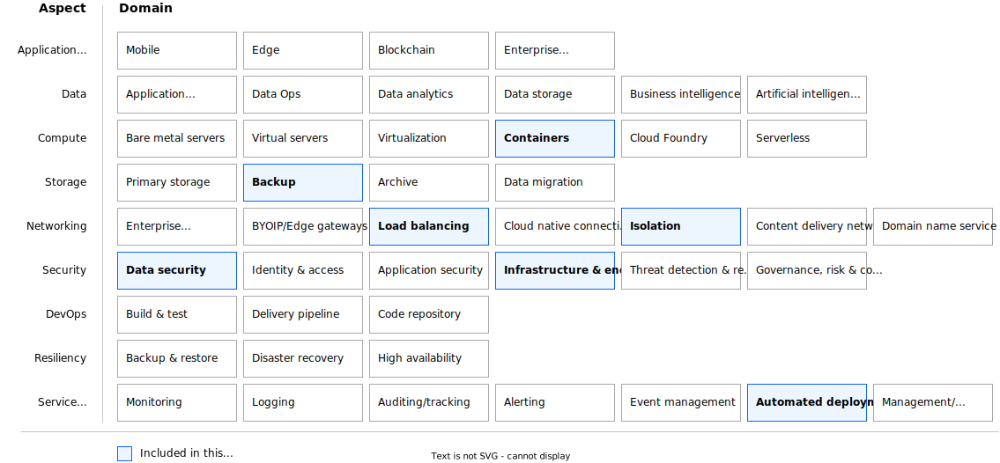

---

copyright:
  years: 2024
lastupdated: "2024-03-04"

keywords:

subcollection: deployable-reference-architectures

authors:
  - name: "Vincent Burckhardt"

# The release that the reference architecture describes
version: 5.16.0

# Whether the reference architecture is published to Cloud Docs production.
# When set to false, the file is available only in staging. Default is false.
production: false

# Use if the reference architecture has deployable code.
# Value is the URL to land the user in the IBM Cloud catalog details page
# for the deployable architecture.
# See https://test.cloud.ibm.com/docs/get-coding?topic=get-coding-deploy-button
deployment-url: unknown

docs: https://cloud.ibm.com/docs/secure-infrastructure-vpc

image_source: https://github.com/terraform-ibm-modules/terraform-ibm-landing-zone/blob/main/reference-architectures/roks-quickstart.drawio.svg

related_links:
  - title: "Red Hat OpenShift Container Platform on VPC landing zone"
    url: "https://cloud.ibm.com/docs/secure-infrastructure-vpc?topic=secure-infrastructure-vpc-ocp-ra"
    description: "Red Hat OpenShift Container Platform on VPC landing zone is a deployable architecture solution that is based on the IBM Cloud for Financial Services reference architecture. It creates secure and compliant Red Hat OpenShift Container Platform workload clusters on a Virtual Private Cloud (VPC) network."

use-case: Cybersecurity
industry: Banking,FinancialSector

content-type: reference-architecture

---

{{site.data.keyword.attribute-definition-list}}

# Red Hat OpenShift Container Platform on VPC landing zone - QuickStart variation
{: #roks-ra-qs}
{: toc-content-type="reference-architecture"}
{: toc-industry="Banking,FinancialSector"}
{: toc-use-case="Cybersecurity"}
{: toc-version="5.16.0"}

The QuickStart variation of the Red Hat OpenShift Container Platform on VPC landing zone deployable architecture creates a fully customizable Virtual Private Cloud (VPC) environment in a single region. The solution provides a single Red Hat OpenShift cluster in a secure VPC for your workloads. The QuickStart variation is designed to deploy quickly for demonstration and development.

## Architecture diagram
{: #ra-roks-qs-architecture-diagram}

{: caption="Figure 1. QuickStart variation of Red Hat OpenShift Container Platform on VPC landing zone" caption-side="bottom"}{: external download="roks-quickstart.drawio.svg"}

## Design concepts
{: #ra-roks-qs-design-concepts}

{: caption="Figure 2. Scope of the design concepts" caption-side="bottom"}

## Requirements
{: #ra-roks-qs-requirements}

The following table outlines the requirements that are addressed in this architecture.

| Aspect | Requirements |
|---|---|
| Compute | Red Hat OpenShift cluster deployment with minimal machine size and nodes, suitable for low-cost demonstration and development |
| Storage | Red Hat OpenShift required storage only, no additional storage supplied |
| Networking | * Two VPCs deployed to demonstrate the concept of a "management-workload" relationship with a transit gateway. \n * All inbound and outbound traffic is allowed to VPCs. \n * Red Hat OpenShift cluster deployed with public administration endpoint to allow easy access to APIs and web console. \n * Load Balancer for cluster workload services. \n * Public Gateways on workload subnets to facilitate outbound internet access from cluster. \n * Transit Gateway to connect the management and workload VPCs. |
| Security | * Encrypt all application data in transit and at rest to protect from unauthorized disclosure. \n * Encryption keys stored in IBM Cloud Key Protect service. * \n Protect cluster administration access through IBM Cloud security protocols. |
| Service Management | Automated deployment of infrastructure with IBM Cloud catalog |
{: caption="Table 1. Requirements" caption-side="bottom"}

## Components
{: #ra-roks-qs-components}

The following table outlines the products or services used in the architecture for each aspect.

| Aspects | Architecture components | How the component is used |
|---|---|---|
| Compute | Red Hat OpenShift Container Platform | Container execution |
| Storage | Cloud Object Storage | Requirement for Red Hat OpenShift deployment |
| Networking | * VPC Load Balancers \n * Public Gateway \n * Transit Gateway | * Application load Balancing for cluster workloads \n * For cluster access to the internet \n * For private network connectivity between VPCs |
| Security | * IAM \n * Key Protect | * IBM Cloud Identity & Access Management \n * Key Management Service |
{: caption="Table 2. Components" caption-side="bottom"}
