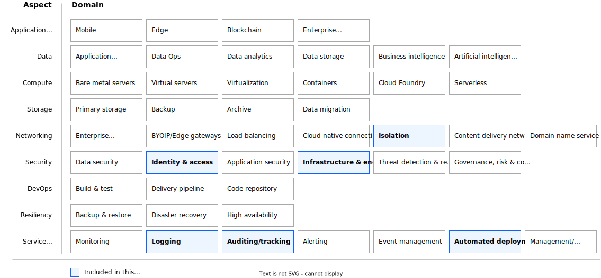

---

copyright:
  years: 2023
lastupdated: "2023-04-10"

keywords:

subcollection: deployable-reference-architectures

authors:
  - name: "Vincent Burckhardt"

# The release that the reference architecture describes
version: 1.0

# Use if the reference architecture has deployable code.
# Value is the URL to land the user in the IBM Cloud catalog details page
# for the deployable architecture.
# See https://test.cloud.ibm.com/docs/get-coding?topic=get-coding-deploy-button
deployment-url: https://cloud.ibm.com/catalog/architecture/deploy-arch-ibm-slz-vpc-9fc0fa64-27af-4fed-9dce-47b3640ba739-global

docs: https://cloud.ibm.com/docs/secure-infrastructure-vpc

image_source: https://github.com/terraform-ibm-modules/terraform-ibm-landing-zone/blob/main/reference-architectures/vpc.drawio.svg

related_links:
  - title: "VPC landing zone - Standard variation"
    url: "https://cloud.ibm.com/docs/deployable-reference-architectures?topic=deployable-reference-architectures-vsi-ra"
    description: "A deployable architecture that is based on the IBM Cloud for Financial Services reference and that provides virtual servers in a secure VPC for your workloads."

use-case: Cybersecurity
industry: Banking,FinancialSector
compliance: FedRAMP

content-type: reference-architecture

---

{{site.data.keyword.attribute-definition-list}}

# VPC landing zone - Standard variation
{: #vpc-ra}
{: toc-content-type="reference-architecture"}
{: toc-industry="Banking,FinancialSector"}
{: toc-use-case="Cybersecurity"}
{: toc-compliance="FedRAMP"}
{: toc-version="1.0"}

The Standard variation of the VPC landing zone deployable architecture uses two Virtual Private Clouds (VPC), a Management VPC, and a Workload VPC to manage the environment and the deployed workload. Each VPC is a multi-zoned, multi-subnet implementation that keeps your workloads secure. A transit gateway connects the VPCs to each other and Virtual Private Endpoints are used connect to IBM Cloud services.

IBM Cloud Flow Logs for VPC enables the collection and storage of information about the internet protocol (IP) traffic that is going to and from network interfaces within your VPC. In addition, Activity Tracker logs events from enabled services. IBM Cloud Flow Logs for VPC and Activity Tracker are included in this deployable architecture. You can add more security services, such as Hyper Connect Crypto Services.

## Architecture diagram
{: #ra-vpc-architecture-diagram}

{: caption="Figure 1. Standard variation of VPC landing zone" caption-side="bottom"}{: external download="vpc.drawio.svg"}

## Design requirements
{: #ra-vpc-qs-design-requirements}

{: caption="Figure 2. Scope of the design requirements" caption-side="bottom"}

<!--
TODO: Add the typical use case for the architecture.
The use case might include the motivation for the architecture composition,
business challenge, or target cloud environments.
-->
## Components
{: #ra-vpc-components}

### VPC architecture decisions
{: #ra-vpc-components-arch}

| Requirement | Component | Reasons for choice | Alternative choice |
|-------------|-----------|--------------------|--------------------|
| * Provide infrastructure/application administration access to monitor, operate, and maintain the environment.  \n * Limit the number of infrastructure/application administration entry points to ensure security audit. | Management VPC service | Create a separate VPC service where SSH connectivity from outside is allowed | |
| * Provide infrastructure for service management components like backup, monitoring, IT service management, shared storage  \n * Ensure you can reach all IBM Cloud and on-premises services | Workload VPC service | Create a separate VPC service as an isolated environment, without direct public internet connectivity and without direct SSH access | |
| * Set up network for all created services  \n * Isolate network for all created services  \n * Ensure all created services are interconnected | Secure landing zone components | Create a minimum set of required components for a secure landing zone | Create a modified set of required components for a secure landing zone in preset |
{: caption="Table 1. Architecture decisions" caption-side="bottom"}

### Network security architecture decisions
{: #ra-vpc-components-arch-net-sec}

| Requirement | Component | Reasons for choice | Alternative choice |
|-------------|-----------|--------------------|--------------------|
| * Isolate management VPC and allow only a limited number of network connections  \n * All other connections from or to management VPC are forbidden | ACL and security group rules in management VPC|Open following ports by default: 22 (for limited number of IPs)  \n All ports to other VPCs are open |More ports might be opened in preset or added manually after deployment |
| * Isolate workload VPC and allow only a limited number of network connections  \n * All other connections from or to workload VPC are forbidden | ACL and security group rules in workload VPC | Open following ports by default: 53 (DNS service)  \n All ports to other VPCs are open | More ports might be opened in preset or added manually after deployment |
| Enable floating IP on bastion host to execute deployment | Floating IPs on bastion host in management VPC | Use floating IP on bastion host from IBM Schematics to complete deployment | |
| Load VPN configuration to simplify VPN setup | VPNs | VPN configuration is the responsibility of the customer | |
{: caption="Table 2. Network security architecture decisions" caption-side="bottom"}

### Key and password management architecture decisions
{: #ra-vpc-components-arch-key-pw}

| Requirement | Component | Reasons for choice | Alternative choice |
|-------------|-----------|--------------------|--------------------|
| * Do not allow any other SSH login methods except the one with the specified public and private SSH key pair | Public and private SSH keys provided by customer | Ask customer to specify the keys. Accept the input as secure parameter or as reference to the key stored in IBM Cloud Secure Storage Manager. Do not print SSH keys in any log files. Do not persist the private SSH key. | |
{: caption="Table 3. Key and password management architecture decisions" caption-side="bottom"}

<!--
## Compliance
{: #ra-vpc-compliance}

TODO: Decide whether to include a compliance section, and if so, add that information

_Optional section._ Feedback from users implies that architects want only the high-level compliance items and links off to control details that team members can review. Include the list of control profiles or compliance audits that this architecture meets. For controls, provide "learn more" links to the control library that is published in the IBM Cloud Docs. For audits, provide information about the compliance item.
 -->

<!--
## Next steps
{: #ra-vpc-next-steps}

TODO: Decide what next steps to list, if any

Optional section. Include links to your deployment guide or next steps to get started with the architecture. -->
