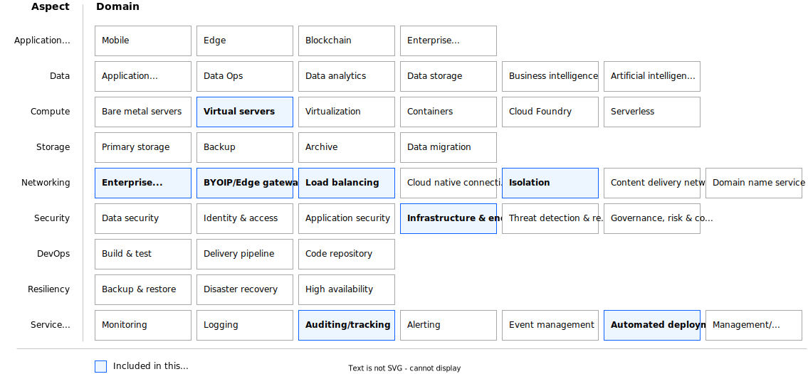

---

copyright:
  years: 2023, 2024
lastupdated: "2024-09-26"

keywords:

subcollection: deployable-reference-architectures

authors:
  - name: "Vincent Burckhardt"

# The release that the reference architecture describes
version: 8.5.0

# Whether the reference architecture is published to Cloud Docs production.
# When set to false, the file is available only in staging. Default is false.
production: true

# Use if the reference architecture has deployable code.
# Value is the URL to land the user in the IBM Cloud catalog details page
# for the deployable architecture.
# See https://test.cloud.ibm.com/docs/get-coding?topic=get-coding-deploy-button
deployment-url: https://cloud.ibm.com/catalog/architecture/deploy-arch-ibm-slz-vsi-ef663980-4c71-4fac-af4f-4a510a9bcf68-global

docs: https://cloud.ibm.com/docs/secure-infrastructure-vpc

image_source: https://github.com/terraform-ibm-modules/terraform-ibm-landing-zone/reference-architectures/vsi-pattern.png

related_links:
  - title: "Landing zone for applications with virtual servers - QuickStart variation"
    url: "https://cloud.ibm.com/docs/deployable-reference-architectures?topic=deployable-reference-architectures-vsi-ra-qs"
    description: "The Landing zone for applications with virtual servers QuickStart variation is a deployable architecture that provides virtual servers in a VPC in a single region. The QuickStart variation is designed to deploy quickly for demonstration and development."
  - title: "Landing zone for applications with virtual servers - Standard variation"
    url: "https://cloud.ibm.com/docs/deployable-reference-architectures?topic=deployable-reference-architectures-vsi-ra"
    description: "A deployable architecture that is based on the IBM Cloud for Financial Services reference and that provides virtual servers in a secure VPC for your workloads."

use-case: Cybersecurity
industry: Banking,FinancialSector

content-type: reference-architecture

---

{{site.data.keyword.attribute-definition-list}}

# Landing zone for applications with virtual servers - QuickStart variation
{: #vsi-ra-qs}
{: toc-content-type="reference-architecture"}
{: toc-industry="Banking,FinancialSector"}
{: toc-use-case="Cybersecurity"}
{: toc-version="8.5.0"}

The QuickStart variation of the Landing zone for applications with virtual servers deployable architecture creates a fully customizable Virtual Private Cloud (VPC) environment in a single region. The solution provides virtual servers in a secure VPC for your workloads. The QuickStart variation is designed to deploy quickly for demonstration and development.

## Architecture diagram
{: #ra-vsi-qs-architecture-diagram}

{: caption="QuickStart variation of Landing zone for applications with virtual servers" caption-side="bottom"}{: external download="vsi-quickstart.drawio.svg"}

## Design requirements
{: #ra-vsi-qs-qs-design-requirements}

{: caption="Figure 2. Scope of the design requirements" caption-side="bottom"}

<!--
TODO: Add the typical use case for the architecture.
The use case might include the motivation for the architecture composition,
business challenge, or target cloud environments.
-->
## Components
{: #ra-vsi-qs-components}

### VPC architecture decisions
{: #ra-vsi-qs-components-arch}

| Requirement | Component | Reasons for choice | Alternative choice |
|-------------|-----------|--------------------|--------------------|
| * Provide infrastructure or application administration access to monitor, operate, and maintain the environment  \n * Limit the number of infrastructure or application administration entry points to help ensure security audit. | Management VPC service | Create a separate VPC service where SSH connectivity from outside is allowed | |
| * Provides compute, storage, and network services to support hosted applications and operations that deliver services to the consumer. \n * Ensure you can reach IBM Cloud services, Workload VPC, and Management VPC | Workload VPC service|Create a separate VPC service as an isolated environment, without direct public internet connectivity and without direct SSH access | |
| Create a virtual server instance to support hosted applications | Workload virtual server instance | Create a VPC virtual server instance that can act as a workload server to support hosted applications. Configure ACL and security group rules allow access to IBM Cloud services, Workload and Management VPCs | |
| Create a virtual server instance as the only management access point to the environment | Jump box host VPC instance | Create a Linux VPC instance that acts as a jump box host. Configure ACL and security group rules to allow SSH connectivity (port 22). Add a public IP address to the VPC instance. | |
| * Set up network for all created services \n * Isolate network for all created services \n * Ensure all created services are interconnected | Secure landing zone components | Create a minimum set of required components for a secure landing zone | Create a modified set of required components for a secure landing zone in preset |
{: caption="Architecture decisions" caption-side="bottom"}

### Network security architecture decisions
{: #ra-vsi-qs-components-arch-net-sec}

| Requirement | Component | Reasons for choice | Alternative choice |
|-------------|-----------|--------------------|--------------------|
| * Isolate management VPC and allow SSH network connections from public network  \n * All other connections from or to management VPC are forbidden except for IBM services and VPC | ACL and security group rules in management VPC|Open following ports by default: 22 (for limited number of IPs)  \n All ports to other VPCs are open |More ports might be opened in preset or added manually after deployment |
| * Isolate workload VPC and allow only a limited number of network connections  \n * All other connections from or to workload VPC are forbidden | ACL and security group rules in workload VPC | Allow connectivity for IBM Cloud services, Workload VPC and Management VPC | More ports might be opened in preset or added manually after deployment |
| Enable floating IP on jump box host | Floating IPs on jump box host in management VPC|Use floating IP on jump box host for administration access | |
{: caption="Network security architecture decisions" caption-side="bottom"}

### Key and password management architecture decisions
{: #ra-vsi-qs-components-arch-key-pw}

| Requirement | Component | Reasons for choice | Alternative choice |
|-------------|-----------|--------------------|--------------------|
| * Use public SSH key to access virtual server instances by using SSH | Public SSH key provided by customer | Ask customer to specify the key. Accept the input as secure parameter. | |
{: caption="Key and passwords management architecture decisions" caption-side="bottom"}

## Next steps
{: #ra-vsi-qs-next-steps}

- Read about [IBM Cloud for Financial Services](/docs/framework-financial-services?topic=framework-financial-services-about)

- To deploy this architecture, understand [Deploying a landing zone deployable architecture](/docs/secure-infrastructure-vpc?topic=secure-infrastructure-vpc-deploy) steps.
