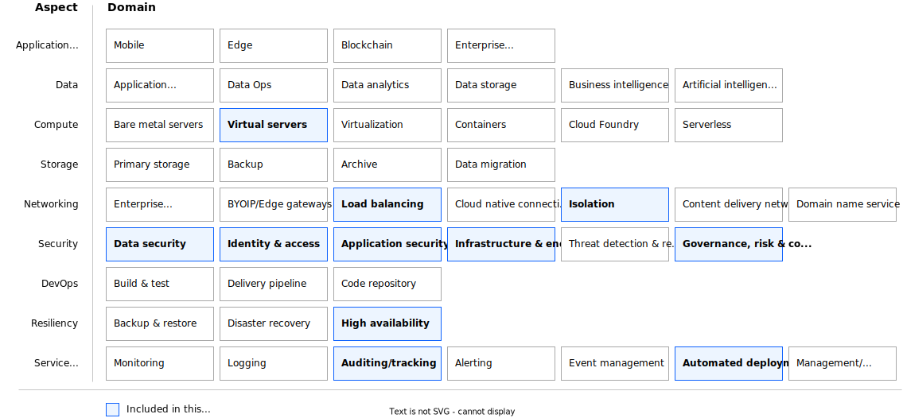

---

copyright:
  years: 2023
lastupdated: "2023-05-05"

keywords:

subcollection: deployable-reference-architectures

authors:
  - name: "Vincent Burckhardt"

# The release that the reference architecture describes
version: 3.6.4

# Whether the reference architecture is published to Cloud Docs production.
# When set to false, the file is available only in staging. Default is false.
production: true

# Use if the reference architecture has deployable code.
# Value is the URL to land the user in the IBM Cloud catalog details page
# for the deployable architecture.
# See https://test.cloud.ibm.com/docs/get-coding?topic=get-coding-deploy-button
deployment-url: https://cloud.ibm.com/catalog/architecture/deploy-arch-ibm-slz-vsi-ef663980-4c71-4fac-af4f-4a510a9bcf68-global

docs: https://test.cloud.ibm.com/docs/secure-infrastructure-vsi

image_source: https://github.com/terraform-ibm-modules/terraform-ibm-landing-zone/blob/main/reference-architectures/vsi-vsi.drawio.svg

related_links:
  - title: "VSI on VPC landing zone - QuickStart variation"
    url: "https://cloud.ibm.com/docs/deployable-reference-architectures?topic=deployable-reference-architectures-vsi-ra-qs"
    description: "The VSI on VPC landing zone QuickStart variation is a deployable architecture that provides virtual servers in a VPC in a single region. The QuickStart variation is designed to deploy quickly for demonstration and development."
  - title: "Red Hat OpenShift Container Platform on VPC landing zone"
    url: "https://cloud.ibm.com/docs/deployable-reference-architectures?topic=deployable-reference-architectures-ocp-ra"
    description: "A deployable architecture that provides virtual servers in a secure VPC for your workloads."

use-case: Cybersecurity
industry: Banking,FinancialSector
compliance: FedRAMP

content-type: reference-architecture

---

{{site.data.keyword.attribute-definition-list}}

# VSI on VPC landing zone - Standard variation
{: #vsi-ra}
{: toc-content-type="reference-architecture"}
{: toc-industry="Banking,FinancialSector"}
{: toc-use-case="Cybersecurity"}
{: toc-compliance="FedRAMP"}
{: toc-version="3.6.4"}

The Standard variation of the VSI on VPC landing zone deployable architecture is based on the IBM Cloud for Financial Services reference architecture. The architecture creates a customizable and secure infrastructure, with virtual servers, to run your workloads with a Virtual Private Cloud (VPC) in multizone regions.

## Architecture diagram
{: #ra-vsi-architecture-diagram}

{: caption="Figure 1. Standard variation of VSI on VPC landing zone" caption-side="bottom"}{: external download="vsi-vsi.drawio.svg"}

## Design requirements
{: #ra-vsi-design-requirements}

{: caption="Figure 2. Scope of the design requirements" caption-side="bottom"}

<!--
TODO: Add the typical use case for the architecture.
The use case might include the motivation for the architecture composition,
business challenge, or target cloud environments.
-->

## Components
{: #ra-vsi-components}

### VPC architecture decisions
{: #ra-vsi-components-arch}

| Requirement | Component | Reasons for choice | Alternative choice |
|-------------|-----------|--------------------|--------------------|
| * Provide infrastructure and administration access  \n * Limit the number of infrastructure administration entry points to ensure security audit | Management VPC service | Create a separate VPC service for management and maintenance of workload resources and access through a site-to-site VPN | |
| * Provide infrastructure for service management components like backup, monitoring, IT service management, shared storage  \n * Ensure you can reach all IBM Cloud and on-premises services | Workload VPC service | Create a separate VPC service as an isolated environment to support hosted applications | |
| Create virtual server instances to support management | Management virtual server instances | Create a VPC virtual server instance that can be used for management and maintenance of your hosted application. Configure ACL and security group rules to allow access to IBM Cloud services, and workload and management VPCs. | |
| Create virtual server instances to support hosted applications | Workload virtual server instances | Create a VPC virtual server instance that can act as a workload server to support hosted applications. Configure ACL and security group rules to allow access to IBM Cloud services, workload and management VPCs. | |
| * Demonstrate compliance with control requirements of the IBM Cloud Framework for Financial Services  \n * Set up network for all created services  \n * Isolate network for all created services  \n * Ensure all created services are interconnected | Secure landing zone components | Create a minimum set of required components for a secure landing zone | Create a modified set of required components for a secure landing zone in preset |
{: caption="Table 1. Architecture decisions" caption-side="bottom"}

### Network security architecture decisions
{: #ra-vsi-components-arch-net-sec}

| Requirement | Component | Reasons for choice | Alternative choice |
|-------------|-----------|--------------------|--------------------|
| * Isolate management VPC and allow only a limited number of network connections  \n * All other connections from or to management VPC are forbidden | ACL and security group rules in management VPC | Isolate environment for access through site-to-site VPN  \n * All ports to other VPCs are open | More ports might be opened in preset or added manually after deployment |
| * Isolate workload VPC and allow only a limited number of network connections  \n * All other connections from or to workload VPC are forbidden | ACL and security group rules in workload VPC | All ports to other VPCs are open | More ports might be opened in preset or added manually after deployment |
| Load VPN configuration to simplify VPN setup | VPNs | VPN configuration is the responsibility of the customer | |
| Collect and store Internet Protocol (IP) traffic information with Activity Tracker and Flow Logs | Activity Tracker | | |
| Securely connect to multiple networks with a site-to-site virtual private network | | | |
{: caption="Table 2. Network security architecture decisions" caption-side="bottom"}

### Key and password management architecture decisions
{: #ra-vsi-components-arch-key-pw}

| Requirement | Component | Reasons for choice | Alternative choice |
|-------------|-----------|--------------------|--------------------|
| * Use public SSH key to access virtual server instances by using SSH | Public SSH key provided by customer | Ask customer to specify the key. Accept the input as secure parameter. | |
{: caption="Table 3. Key and password management architecture decisions" caption-side="bottom"}

<!--
## Compliance
{: #ra-vsi-compliance}

_Optional section._ Feedback from users implies that architects want only the high-level compliance items and links off to control details that team members can review. Include the list of control profiles or compliance audits that this architecture meets. For controls, provide "learn more" links to the control library that is published in the IBM Cloud Docs. For audits, provide information about the compliance item.
-->

## Next steps
{: #ra-vsi-next-steps}

Read about [IBM Cloud for Financial Services](/docs/framework-financial-services?topic=framework-financial-services-about)
